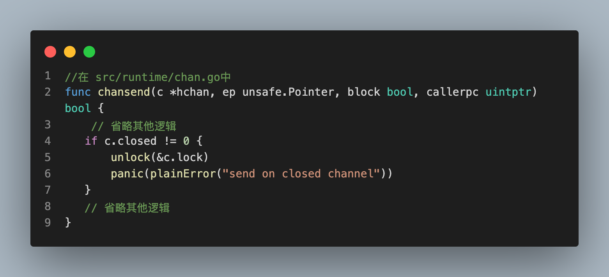

## make和new的区别：
1. new(T):
- new 是一个内建函数,用于动态分配内存。
- new(T) 会为类型 T 的新值分配内存,并返回一个指向该内存的指针,类型为 *T。
- 使用 new 分配的内存会被初始化为 T 类型的零值。

2. make(T, args):
- make 是一个内建函数,主要用于创建 slice、map 和 channel。
- make(T, args) 返回的是一个 T 类型的初始化后的值,而不是指针。
- make 函数的参数类型和数量因 T 的类型而不同:
- - 对于 slice: make([]T, len, cap)
- - 对于 map: make(map[K]V, cap)
- - 对于 channel: make(chan T, buffer)


## Go语言中的panic和recover有什么作用？
1. panic和recover是Go语言中用于处理异常的机制。
2. 当程序遇到无法处理的错误时，可以使用panic引发一个异常，中断程序的正常执行。
3. 而recover用于捕获并处理panic引发的异常，使程序能够继续执行。

## defer 语句的执行顺序是"后进先出"(LIFO)的。
```golang
defer wg.Done()
mu.Lock()
defer mu.Unlock()
m[fmt.Sprintf("key%d", id)] = id
```
- 具体执行顺序如下:
- - 执行 m[fmt.Sprintf("key%d", id)] = id
- - 执行 defer mu.Unlock()
- - 执行 defer wg.Done()


## 原子操作和锁是两种不同的同步机制，用于处理并发编程中的同步问题。
1. 原子操作适用于对单个变量的读写操作，具有较低的性能开销。
2. 而锁适用于对一段代码或一组操作的访问进行同步，具有更高的性能开销。
3. 选择使用原子操作还是锁取决于具体的场景和需求。
4. 需要注意的是，原子操作通常用于对共享变量进行简单的读写操作，而锁更适用于对临界区的访问进行复杂的操作和保护。


## 如果往一个已经 close() 的 channel 发送消息
会产生 panic,读取已关闭的 channel 可以获得零值, 若使用 range 读取 channel, 则 close 后会终止循环

## golang中map的底层实现原理
1. map 的底层实现是哈希表(hash table)
2. map 的键必须是可比较的类型,即可以使用 == 运算符进行比较。
3. map 的值可以是任意类型。
4. map 的键值对是无序的。

- map的底层实现是使用哈希表(hash table)来实现的。当两个不同的键映射到了同一个桶时,会发生哈希冲突。Golang 中采用了"链地址法"来解决哈希冲突,即在同一个桶内以链表的形式存储冲突的键值对

## slice底层实现原理
1. slice 实际上是一个指向底层数组的引用。slice 结构体包含了指向底层数组的指针、slice 的长度和容量。
2. 当创建一个 slice 时,实际上是创建了一个 slice 结构体,而不是直接创建一个新的数组
- 当对 slice 进行"切片"操作时,新 slice 会指向原有 slice 的部分元素,共享底层数组。
- slice 只是一个指向底层数组的引用,不会自己分配内存,仅保存了指向数组的指针、长度和容量。

## map进行有序的排序：

- 将 map 的键值对转换成一个切片,然后使用 sort.Slice() 函数对切片进行排序。排序时可以自定义比较函数

## go语言协程调度原理，协程为什么快
- 协程调度原理:
- -	M-P-G 模型: Go 语言采用了 M-P-G 的协程调度模型。其中 M 代表 OS 线程(Machine)、P 代表逻辑处理器(Processor)、G 代表协程(Goroutine)。
- -	P 和 G: 每个 P 都有自己的协程队列,管理着一组 G。P 会从自己的协程队列中取出 G 并执行。当一个 G 被阻塞(例如 I/O 操作)时,P 会将它暂时放到自己的协程队列中,然后执行其他 G。
- - M 和 P: 一个 M 可以绑定多个 P,但一个 P 只能绑定一个 M。当一个 P 的 G 全部被阻塞时,M 会寻找其他 P 的就绪 G 来执行。

- 为什么快：轻量级、并发效率高、抢占式调度


## 逃逸的场景有哪些，主要是因为什么引起的
1. 返回局部变量的地址:
-	当一个函数返回一个局部变量的地址时,该变量就会逃逸到堆上。
-	因为函数返回后,局部变量的生命周期超出了函数的范围,必须分配在堆上才能保证安全。
2. 向函数外部传递局部变量:
-	如果将一个局部变量的地址传递给函数外部的变量,该局部变量就会逃逸。
-	原因同上,局部变量的生命周期超出了函数的范围。
3. 动态分配的内存:
-	使用 new() 或 make() 动态分配的内存空间,其地址会逃逸到堆上。
-	因为这些动态分配的内存空间,其生命周期是不确定的,无法确定是否可以放在栈上。
4. 接口类型的变量:
-	当一个变量赋值给接口类型的变量时,该变量可能会逃逸。
-	这是因为接口类型需要额外的信息来描述底层的具体类型,这些信息需要存储在堆上。
5. 闭包:
-	当一个函数内部定义并返回了一个闭包时,闭包引用的外部变量就会逃逸。
-	这是因为闭包需要保留对外部变量的引用,因此这些变量必须分配在堆上。
6. slice、map 和 channel:
-	这些复合数据类型的底层实现通常需要在堆上分配内存,因此它们的元素也会逃逸

## 讲一下gc
- 定义：垃圾回收是一种自动内存管理机制，它负责识别和释放不再使用的内存，从而避免内存泄漏。
重要性：在 Go 中，GC 是自动进行的，这减少了程序员手动管理内存的工作量，降低了出错的可能性。
- Go 的 GC 特点
1. 三色标记算法：Go 使用三色标记法来进行垃圾收集。这个过程分为白色、灰色和黑色对象，通过追踪引用关系来确定哪些对象仍然活跃。
2. 并发执行：Go 的 GC 是并发的，意味着垃圾收集可以在程序运行时进行，尽量减少停顿时间（STW, Stop-The-World），提高应用程序的响应性。
3. 非分代收集：与 Java 等语言不同，Go 的 GC 不是基于分代的。所有对象都在同一个堆中处理，这样可以简化垃圾收集逻辑，但可能会增加一些开销。
4. 非紧缩：Go 的 GC 不会移动存活的对象，而是使用指针更新来清理死对象的空间。这种方法避免了因移动对象而导致的额外开销。
5. 混合写屏障：为了支持并发标记，Go 引入了混合写屏障技术，它可以追踪在标记过程中发生的指针更新，确保不会遗漏任何存活的对象。
6. 触发时机: 基于分配速度：GC 通常会在程序分配了一定量的新内存后触发。这个阈值会根据上一次 GC 后剩余的堆大小动态调整。
7. 显式调用：开发者也可以通过 runtime.GC() 显式地触发一次 GC，但这在大多数情况下并不推荐，因为自动 GC 已经很高效。
8. 性能优化:降低 STW 时间：Go 团队一直在努力减少 GC 的停顿时间，以提供更好的用户体验。
9. 可配置参数：可以通过设置 GOGC 环境变量或使用 debug.SetGCPercent 函数来调整 GC 的行为，比如设置堆增长的比例。

## 说一下slice的扩容机制
- 切片的扩容机制是这样的：

1. 初始分配：使用 make 函数创建一个切片时，可以指定长度和容量。如果没有指定容量，Go 会根据长度自动选择一个合适的容量。

2. 容量不足时的处理：当使用 append 函数向切片追加元素时，如果当前容量不足以容纳新元素，Go 会创建一个新的更大的底层数组。扩容的具体规则如下：

3. 如果旧容量小于 256：新容量 = 旧容量 * 2。
4. 如果旧容量大于等于 256：新容量 = 旧容量 + （3 * 256 + 旧容量）/ 4。
5. 数据迁移：将旧数组中的所有元素复制到新数组中，并更新切片的底层数组指针，使其指向新数组。
6. 继续操作：在新数组上继续进行追加或其他操作

## 标准 map 的并发安全性
非并发安全：标准 map 在多 goroutine 环境下不保证线程安全。如果需要在并发环境中使用 map，必须自己实现同步机制，例如使用 sync.Mutex 或 sync.RWMutex 来保护 map 的访问。

## sync.Map 的底层实现

1. 结构体定义：
- sync.Map 内部包含两个主要部分：一个用于读取的 read 结构和一个用于写入的 dirty 结构。
2. read 结构：
- read 结构主要用于读取操作，它包含一个指针数组 m 和一个计数器 count。
- m 数组存储键值对。
- count 记录当前 read 结构中的条目数量。
- 如果 count 为负数，表示正在进行写入操作或 read 结构已经被废弃。
3. dirty 结构：
- dirty 结构用于写入操作，它包含一个带锁的 map 和一个删除集合 misses。
- map 存储实际的键值对。
- misses 用于记录那些在 read 结构中被删除但在 dirty 结构中还未删除的键。
4. 读取操作：
- 读取操作首先尝试从 read 结构中获取数据。
- 如果 read 结构中的 count 为负数或没有找到键，则会切换到 dirty 结构进行查找。
5. 写入操作：
- 写入操作总是通过 dirty 结构进行。
- 如果 dirty 结构不存在，则创建一个新的 dirty 结构，并将 read 结构标记为废弃。
- 写入完成后，如果满足某些条件（如 dirty 结构中的条目数量达到一定阈值），会将 dirty 结构的内容复制到新的 read 结构中，以提高后续读取操作的效率。

## sync.Map 和加锁的区别是什么？
- sync.Map 和使用锁的区别在于，sync.Map 不需要在并发访问时进行加锁和解锁操作。相比之下，使用锁需要在并发访问时显式地加锁和解锁，以避免竞争条件和数据竞争问题。
- 在使用锁时，当多个 goroutine 同时访问同一块数据时，必须通过加锁来避免竞争条件。这意味着只有一个 goroutine 能够访问该数据，并且在该 goroutine 完成工作后，其他 goroutine 才能够访问数据。这种方式可以确保数据的一致性，但是加锁会带来额外的开销，并且在高并发情况下可能会影响性能。
相比之下，sync.Map 使用了更高级的算法来避免竞争条件和数据竞争问题，而不需要显式地进行加锁和解锁。当多个 goroutine 同时访问 sync.Map 时，它会自动分配不同的段来存储数据，并且每个段都有自己的读写锁，以避免竞争条件。这种方式可以提高并发性能，减少开销，并且避免死锁等问题。
 - 因此，当需要在并发访问时安全地共享数据时，可以考虑使用 sync.Map 来避免竞争条件和数据竞争问题，并提高性能。而当需要在使用锁时，需要显式地加锁和解锁来保证数据一致性和避免竞争条件。


## Go map中删除一个key的内存是否会立即释放？
- 内存释放：当你删除一个 key 时，该 key 及其对应的值将不再可访问，但这并不意味着相关的内存会立即被释放。Go 语言使用垃圾回收（GC）机制来管理内存。
- 垃圾回收：删除 key 后，如果没有其他引用指向该值，垃圾回收器会在未来的某个时间点释放这部分内存。具体的释放时间由 Go 的垃圾回收算法决定，并不是即时的。


## GMP模型？
1.  G (Goroutines)：
- Goroutine 是 Go 语言中的轻量级线程，可以在同一地址空间中并发运行。创建 Goroutine 只需使用 go 关键字。
- Goroutines 的调度是由 Go 运行时（Go runtime）管理的，允许数以万计的 Goroutine 并发运行。
2. M (Machine)：
- Machine 通常指的是操作系统线程。Go 运行时使用 M 来表示与操作系统线程相关的结构，负责执行 Goroutine。
- 每个 M 线程可以执行一个或多个 Goroutine。
3. P (Processor)：
- Processor 是 Go 运行时的一个抽象，表示一个逻辑处理器。它维护一个本地队列，用于存放待执行的 Goroutine。
- P 的数量通常与机器的核心数相关。Go 运行时会根据可用的 CPU 核心数来调整 P 的数量。

4. Goroutine 调度：
- 当创建一个新的 Goroutine 时，它会被分配到某个 P 的队列中。
- 运行时会根据 Goroutine 的状态和 P 的负载情况来调度 Goroutine 的执行。
5. G、M 和 P 的关系：
- 每个 Goroutine 由 M 执行，M 可能会在 P 上运行。
- P 充当了 Goroutine 的调度器，管理其执行队列。M 可以在不同的 P 之间切换，以便更好地利用 CPU 资源。


## Golang如何优雅关闭一个channel？

1. 只由一个发送者关闭：
通常，只有创建该 channel 的 Goroutine 应该负责关闭它。这可以避免多个 Goroutine 同时关闭同一个 channel 导致的运行时错误。
2. 使用 defer 关闭 channel
3. 使用 for 循环和 ok 变量
- 在接收数据时，使用 for 循环和 ok 变量来判断 channel 是否已经关闭：
```golang
func main() {
    ch := make(chan int)

    go func() {
        for i := 0; i < 5; i++ {
            ch <- i
        }
        close(ch) // 关闭 channel
    }()

    for {
        if v, ok := <-ch; ok {
            fmt.Println(v)
        } else {
            // channel 已关闭，退出循环
            break
        }
    }
}
```
4. 使用 WaitGroup 确保所有 Goroutine 完成
- 在多个 Goroutine 的情况下，使用 sync.WaitGroup 来确保所有 Goroutine 完成后再关闭 channel：
```golang
package main

import (
    "fmt"
    "sync"
)

func main() {
    ch := make(chan int)
    var wg sync.WaitGroup

    // 启动多个 Goroutine
    for i := 0; i < 3; i++ {
        wg.Add(1)
        go func(i int) {
            defer wg.Done()
            for j := 0; j < 2; j++ {
                ch <- i*10 + j
            }
        }(i)
    }

    // 启动一个 Goroutine 关闭 channel
    go func() {
        wg.Wait() // 等待所有 Goroutine 完成
        close(ch) // 关闭 channel
    }()

    // 接收数据
    for v := range ch {
        fmt.Println(v)
    }
}
```
5. 处理关闭后的发送
- 在关闭 channel 后，任何发送操作都会引发运行时错误。因此，确保逻辑上不再向已关闭的 channel 发送数据

## slice是引用传递还是值传递？slice 参数传递过去，修改之后，外部变量是否也会被修改？
1. Slice 的内部结构
- 一个 slice 由三部分组成：
- - 指针：指向底层数组的首地址。
- - 长度：slice 中元素的数量。
- - 容量：底层数组的总大小（从 slice 的起始位置开始）。
2. Slice 的参数传递
- - 当你将 slice 作为参数传递给函数时，传递的是 slice 的引用。因此，在函数内部对 slice 的修改会影响原始 slice。
3. 需要注意的点
- - 重新分配：如果在函数内部对 slice 进行重新分配（例如使用 append 函数），可能会导致原始 slice 不被修改，因为此时可能会创建一个新的底层数组。

## Go读写锁的概念？读的时候会影响别人的读么？读优先还是写优先？
- 读写锁 允许多个 Goroutine 同时读取，但在写入时会阻止所有的读和写操作。
- 读操作不会影响其他读操作，而写操作会阻塞所有的读操作。
- Go 的 sync.RWMutex 是读优先的，但可以通过其他方式实现写优先的行为。

## context的应用场景？
- 控制 Goroutines 的生命周期
``` golang
ctx, cancel := context.WithCancel(context.Background())
go func() {
    // 监听某个条件
    // 如果需要取消
    cancel()
}()
```
- 设置超时和截止时间
``` golang
ctx, cancel := context.WithTimeout(context.Background(), 2*time.Second)
defer cancel()

// 执行可能超时的操作
select {
case result := <-someOperation(ctx):
    // 处理结果
case <-ctx.Done():
    // 超时处理
}
```

- 传递请求范围的值
```golang
ctx := context.WithValue(context.Background(), "userID", userID)

// 在处理请求的其他部分中获取 userID
userID := ctx.Value("userID").(string)
```

- 处理并发操作
```golang
ctx, cancel := context.WithCancel(context.Background())
defer cancel()

var wg sync.WaitGroup
for i := 0; i < 5; i++ {
    wg.Add(1)
    go func(id int) {
        defer wg.Done()
        select {
        case <-ctx.Done():
            // 处理取消
            return
        default:
            // 执行任务
        }
    }(i)
}
wg.Wait()
```
- HTTP 请求的上下文管理
```golang 
http.HandleFunc("/example", func(w http.ResponseWriter, r *http.Request) {
    ctx := r.Context()
    
    // 模拟长时间运行的操作
    select {
    case <-time.After(5 * time.Second):
        fmt.Fprintln(w, "Request completed")
    case <-ctx.Done():
        http.Error(w, ctx.Err().Error(), http.StatusRequestTimeout)
    }
})
```
## select的作用？项目中怎么使用的？
1. 等待多个 channel 操作：同时监听多个 channel 的发送和接收操作。
```golang
select {
case msg1 := <-ch1:
    // 从 ch1 接收到消息
case msg2 := <-ch2:
    // 从 ch2 接收到消息
case ch3 <- msg:
    // 向 ch3 发送消息
case <-time.After(2 * time.Second):
    // 超时处理
}
```

2. 避免阻塞：通过 select，可以避免 Goroutine 在某个 channel 上阻塞，确保程序的灵活性和响应性。
```golang
select {
case msg := <-ch:
    fmt.Println("Received:", msg)
default:
    fmt.Println("No message received")
}
```

3. 处理超时：可以结合 time.After 或 context 来实现超时机制。
```golang
select {
case msg := <-ch:
    fmt.Println("Received:", msg)
case <-time.After(5 * time.Second):
    fmt.Println("Timeout")
}
```

## 数组和切片的区别
#### 定义和基本特性
1. 数组：
- 数组是固定长度的集合，长度在编译时确定。
- 语法示例：var arr [5]int 定义了一个包含 5 个整数的数组。
- 数组的长度是其类型的一部分。例如，[5]int 和 [10]int 是不同的类型。
2. 切片：
- 切片是一个动态大小的、可扩展的数组视图，基于底层数组构建。
- 语法示例：var slice []int 定义了一个整数切片。
- 切片没有固定长度，可以根据需要动态增长。
#### 内存分配
1. 数组：
- 数组的大小在创建时确定，分配在栈上或堆上（取决于上下文）。
- 数组的复制是值传递，即传递整个数组的副本。
2. 切片：
- 切片是对底层数组的引用，包含指向数组的指针、切片的长度和容量。
- 切片的传递是引用传递，只传递指向底层数组的指针，因此切片的修改会影响原始数据。

## Go数据类型有哪些？
1. 基本类型：
- 布尔类型（bool）
- 整数类型（int、int8、int16、int32、int64、uint、uint8、uint16、uint32、uint64）
- 浮点数类型（float32、float64）
- 复数类型（complex64、complex128）
- 字符串类型（string）
- 字符类型（byte、rune）
2. 复合类型：
- 数组类型（[n]T）
- 切片类型（[]T）
- 结构体类型（struct）
- 映射类型（map）
- 通道类型（chan）
- 函数类型（func）
- 接口类型（interface）


## 如何判断两个interface{}相等？
[here]https://blog.csdn.net/weiguang102/article/details/129299867

## init()方法的特性
1. 自动调用
- init() 函数在包被导入时自动调用，无需显式调用。
- 每个包可以定义多个 init() 函数，它们会按照它们在源文件中的出现顺序执行。
2. 初始化操作
- 通常用于执行初始化任务，比如设置包级变量的初始值、注册一些服务或进行其他启动时的配置。
- init() 函数不能接受参数，也没有返回值，这确保了其用途主要是初始化。
3. 包级别的执行顺序
- 如果一个包依赖于其他包，Go 会确保依赖的包的 init() 函数在使用该包的 init() 函数之前执行。
- 多个文件中的 init() 函数会按照文件的字典顺序执行。
4. 不能直接调用
- 不能在代码中直接调用 init() 函数，只能由 Go 运行时自动调用。
- 这使得 init() 函数的使用更加规范和一致。
5. 用于测试和调试
- 可以在 init() 函数中放置一些调试信息或日志，帮助开发者在包加载时了解系统的状态。

## switch-case语句，强制执行下一个case
- 在 Go 语言中，switch 语句默认情况下在匹配到一个 case 后会自动结束，不会继续执行后续的 case。不过，如果你想强制执行下一个 case，可以使用 fallthrough 关键字。

## encoding/json 包解码通过 HTTP 请求接收的 JSON 数据时，它会默认将所有数字解析为 float64 类型

## Go里面的类型断言？
- 原理：当对接口类型的变量进行类型断言时，Golang 运行时会检查变量的动态类型是否满足断言的类型。如果满足，类型断言就会成功，变量会被转换为对应的类型；如果不满足，则断言失败。
- 语法：
```golang
value, ok := x.(T)
```
- - x 是一个接口类型的变量，T 是希望断言的类型。value 将会是 x 转换为类型 T 后的值，ok 是一个布尔值，当类型断言成功时为 true，失败时为 false 。如果不关心断言是否成功，也可以只写成如下形式：
```golang
value := x.(T)
```
但如果断言失败，这种写法会引发 panic。在进行类型断言时，需要注意其安全性。如果不确定 x 的实际类型是否为 T 时，最好使用安全的类型断言，即同时返回一个转换是否成功的布尔值，避免在类型断言失败时导致程序崩溃。
类型断言的必要条件是 x 必须是接口类型，非接口类型的 x 不能做类型断言。此外，T可以是非接口类型，如果想断言成功，则 T 应该实现 x 的接口。T 也可以是接口，则 x 的动态类型也应该实现接口 T。
- 使用场景：
1. 检查类型：确定接口值的具体类型。
2. 接口值的类型转换：将接口值转换为具体的类型。
3. 实现多态行为：Golang 中的多态主要是通过接口实现的，根据接口值的具体类型执行不同的操作，从而实现多态

## Go静态类型声明？
- 所谓的静态类型（即 static type），就是变量声明的时候的类型。
```golang
var age int   // int 是静态类型
var name string  // string 也是静态类型
```
- 所谓的 动态类型（即 concrete type，也叫具体类型）是 程序运行时系统才能看见的类型。这是什么意思呢？我们都知道 空接口 可以承接什么问题类型的值，什么 int 呀，string 呀，都可以接收。比如下面这几行代码:
```golang
var i interface{}   

i = 18  
i = "Go编程时光"  
```
- 第一行：我们在给 i 声明了 interface{} 类型，所以 i 的静态类型就是 interface{},第二行：当我们给变量 i 赋一个 int 类型的值时，它的静态类型还是 interface{}，这是不会变的，但是它的动态类型此时变成了 int 类型。第三行：当我们给变量 i 赋一个 string 类型的值时，它的静态类型还是 interface{}，它还是不会变，但是它的动态类型此时又变成了 string 类型。从以上，可以知道，不管是 i=18 ，还是 i="Go编程时光"，都是当程序运行到这里时，变量的类型，才发生了改变，这就是我们最开始所说的 动态类型是程序运行时系统才能看见的类型

## sync包使用？
- sync.Mutex：互斥锁，确保互斥访问。
- sync.RWMutex：读写互斥锁，允许多个读操作，但独占写操作。
- sync.WaitGroup：等待一组 Goroutine 完成。
- sync.Once：确保某个操作只执行一次。
- sync.Cond：条件变量，允许 Goroutine 等待特定条件。
- sync.Map : 线程安全的map

## gin的并发请求、错误处理、路由处理
1. Gin 会为每个请求创建一个新的 Goroutine，从而实现并发处理。
2. 在 Gin 中，可以通过中间件和上下文（*gin.Context）进行错误处理。
3. 支持简单路由、参数化路由和路由组，便于组织和管理。
```golang
package main

import (
    "github.com/gin-gonic/gin"
    "net/http"
)

func Recovery() gin.HandlerFunc {
    return func(c *gin.Context) {
        defer func() {
            if err := recover(); err != nil {
                c.JSON(http.StatusInternalServerError, gin.H{"error": "internal server error"})
                c.Abort()
            }
        }()
        c.Next()
    }
}

func main() {
    r := gin.Default()
    r.Use(Recovery())

    // 简单路由
    r.GET("/ping", func(c *gin.Context) {
        c.JSON(http.StatusOK, gin.H{"message": "pong"})
    })

    // 参数化路由
    r.GET("/users/:id", func(c *gin.Context) {
        id := c.Param("id")
        c.JSON(http.StatusOK, gin.H{"user_id": id})
    })

    // 错误处理用例
    r.GET("/divide", func(c *gin.Context) {
        a := c.Query("a")
        b := c.Query("b")

        // 简单的错误处理
        if b == "0" {
            c.JSON(http.StatusBadRequest, gin.H{"error": "division by zero"})
            return
        }

        // 处理逻辑
        // ...
    })

    r.Run() // 启动服务，默认监听 :8080
}
```

## CSP并发模型
## 对关闭的channel写为什么会panic？
1. 读已经关闭的chan能一直读到东西，但是读到的内容根据通道内关闭前是否有元素而不同。
- 如果chan关闭前，buffer内有元素还未读,会正确读到chan内的值，且返回的第二个bool值（是否读成功）为true。
- 如果chan关闭前，buffer内有元素已经被读完，chan内无值，接下来所有接收的值都会非阻塞直接成功，返回 channel 元素的零值，但是第二个bool值一直为false。
2. 写已经关闭的chan会panic
- 理由：源码直接是panic

## 字符串转byte数组会发生内存拷贝么？为什么？
1. 字符串与字节数组的区别
- 字符串：字符串在 Go 中是不可变的，一旦创建就不能修改。它是一个包含字符的序列，通常使用 UTF-8 编码。
- 字节数组：字节数组（[]byte）是可变的，允许对其内容进行修改。
2. 转换过程
- 在将字符串转换为字节数组时，Go 会创建一个新的字节数组，并将字符串的内容复制到这个数组中。这是因为：
- - 不可变性：字符串的不可变性要求不能直接修改字符串的内容。因此需要创建新的字节数组来存储该内容。
- - 内存管理：字符串和字节数组在内存中的管理方式不同，直接引用可能会导致数据不一致。

## 如何实现字符串转切片无内存拷贝（unsafe）？
- 标准的转换方法都会发生内存拷贝，所以为了减少内存拷贝和内存申请我们可以使用强转换的方式对两者进行转换。在标准库中有对这两种方法实现：
```golang
// runtime/string.go
func slicebytetostringtmp(ptr *byte, n int) (str string) {
 stringStructOf(&str).str = unsafe.Pointer(ptr)
 stringStructOf(&str).len = n
 return
}

func stringtoslicebytetmp(s string) []byte {
    str := (*stringStruct)(unsafe.Pointer(&s))
    ret := slice{array: unsafe.Pointer(str.str), len: str.len, cap: str.len}
    return *(*[]byte)(unsafe.Pointer(&ret))
}
```
## Go语言channel的特性？channel阻塞信息是怎么处理的？channel底层实现？
首先，我们来了解下如何使用Go语言的Channel。一个Channel可以被视为一个管道，用于连接发送者（发送数据的协程）和接收者（接收数据的协程）。要创建一个Channel，我们使用内置的make函数，例如：ch := make(chan int)。
然后，我们可以通过发送操作将数据发送到Channel中，例如：channel <- data。同样地，我们可以从Channel中接收数据，例如：data := <- channel。值得注意的是，发送和接收操作是阻塞的，这意味着如果Channel为空，接收操作将会阻塞直到有数据可用；反之，如果Channel已满，发送操作将会阻塞直到有空间可用。
接下来，我们将深入探讨Channel的底层原理。在Go语言的并发模型中，每个Channel都有一个与之关联的固定长度的环形队列。这个队列用于暂存发送和接收操作的数据。当一个协程尝试向Channel写入数据时，如果队列已满，该协程将会被阻塞，直到队列中有空间可用。同样地，当一个协程尝试从Channel读取数据时，如果队列为空，该协程将会被阻塞，直到队列中有数据可用。

```golang
type hchan struct {
	qcount   uint           // 缓冲区中元素的数量
	dataqsiz uint           // 缓冲区的大小
	buf      unsafe.Pointer // 缓冲区指针
	elemsize uint16         // 每个元素的大小
	closed   uint32         // 是否已关闭
	sendx    uint           // 发送索引
	recvx    uint           // 接收索引
	recvq    waitq          // 等待接收的 goroutine 队列
	sendq    waitq          // 等待发送的 goroutine 队列
	lock     mutex          // 锁
}
```
## Go的反射原理
Golang反射是通过接口来实现的，通过隐式转换，普通的类型被转换成interface类型，这个过程涉及到类型转换的过程，首先从Golang类型转为interface类型, 再从interface类型转换成反射类型, 再从反射类型得到想的类型和值的信息.

- 反射的应用场景
序列化和反序列化：例如 JSON 编码和解码，通常使用反射来动态访问结构体字段。
ORM 框架：在数据库映射中，使用反射来动态访问对象属性。
测试框架：在单元测试中，动态创建和检查对象的状态。